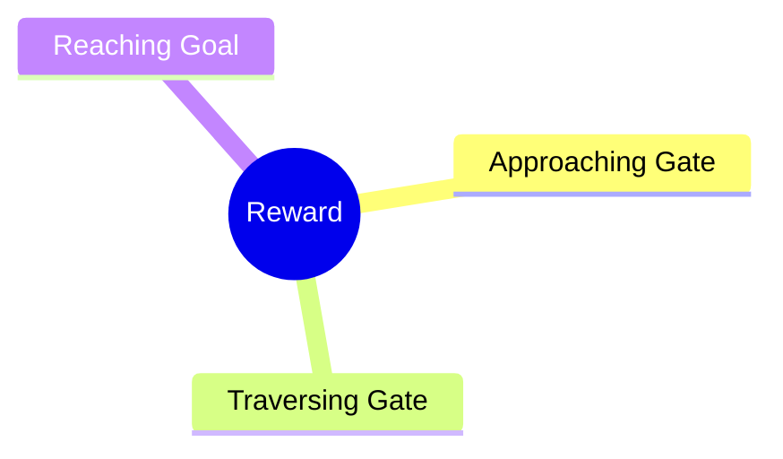
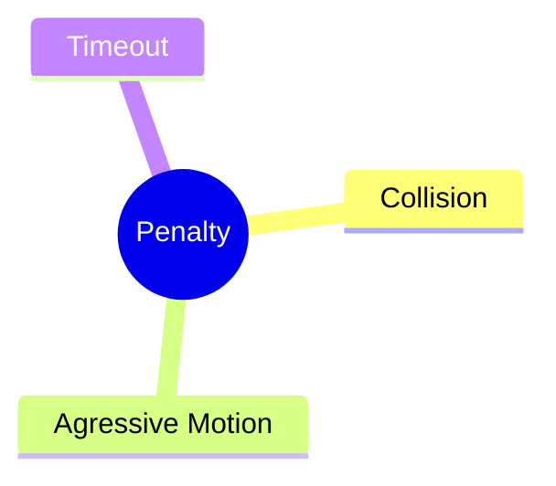

# Reward Design For Traversing the Gate

## Overview

### Observation & Action

$$
\text{observation} = \begin{bmatrix}
    \bold{p}_{gate} \\
    \bold{p}_{goal} \\
    \bold{q}_{drone} \\
    \bold{v}_{drone} \\
    \bold{w}_{drone} \\
    \bold{a}_{k-1} \\
\end{bmatrix} \quad
\text{action} = \mathbf{a}_k = \begin{bmatrix}
    \bold{F}_{drone} \\
    \bold{M}_{drone} \\
\end{bmatrix} \\
\bold{v}_{drone} = \begin{bmatrix}
    v_{x} \\
    v_{y} \\
    v_{z}
\end{bmatrix} \quad
\bold{q}_{drone} = \begin{bmatrix}
    q_{x} \\
    q_{y} \\
    q_{z} \\
    q_{w}
\end{bmatrix} \quad
\bold{w}_{drone} = \begin{bmatrix}
    w_{x} \\
    w_{y} \\
    w_{z}
\end{bmatrix} \\
\bold{p}_{goal} = \begin{bmatrix}
    x_{goal} \\
    y_{goal} \\
    z_{goal}
\end{bmatrix} \quad
\bold{p}_{gate} = \begin{bmatrix}
    \bold{g}_0 \\
    \bold{g}_1 \\
    \bold{g}_2 \\
    \bold{g}_3 \\
\end{bmatrix} \quad
\bold{g}_i = \begin{bmatrix}
    x_{i} \\
    y_{i} \\
    z_{i}
\end{bmatrix} \quad \\
\bold{F}_{drone} = F \quad
\bold{M}_{drone} = \begin{bmatrix}
    M_{x} \\
    M_{y} \\
    M_{z}
\end{bmatrix}
$$

* Observation space: $\mathbb{R}^{29}$, in **body frame**
* Action space: $\mathbb{R}^{4}$
* Action range: $[-1, 1]$

### Reward

The reward for traversing the gate can be mainly divided into three components:

* **Approaching Gate**: The agent is rewarded for approaching the gate's center when it is in front of the gate.
* **Traversing Gate**: The agent is rewarded for moving forward through the gate when it is near the gate.
* **Reaching Goal**: The agent is rewarded for reaching the goal position after passing through the gate.

### Penalty

The penalty for traversing the gate can be mainly divided into three components:

* **Collision**: The agent is penalized for colliding with the gate.
* **Agressive Motion**: The agent is penalized for moving aggressively, which is defined as a large change in acceleration and too large velocity.
* **Timeout**: The agent is penalized for taking too long to traverse the gate.

### Reward Function

$$
R = R_{approaching} + R_{traversing} + R_{reaching} - P_{collision} - P_{aggressive} - P_{timeout}
$$

## Reward Design

### Approaching Gate

The closer the drone is to the gate's center, the bigger the reward will be. The reward is defined as:

$$
R_{approaching} = \alpha * \left[ x_{proj}^k < -l_{traverse} \right] * (\left| \mathbf{g}_{center}^{k-1} \right| - \left| \mathbf{g}_{center}^k \right|) \\
x_{proj}^k = \mathbf{n}_{gate} \cdot (- \mathbf{g}_{center}^k) \\
\mathbf{n}_{gate} = \frac{\left( \mathbf{g}_{1} - \mathbf{g}_{0} \right) \times \left( \mathbf{g}_{2} - \mathbf{g}_{0} \right)}{\left| \left( \mathbf{g}_{1} - \mathbf{g}_{0} \right) \times \left( \mathbf{g}_{2} - \mathbf{g}_{0} \right)  \right|} \quad
\mathbf{g}_{center} = \frac{\mathbf{g}_{0} + \mathbf{g}_{1} + \mathbf{g}_{2} + \mathbf{g}_{3}}{4}
$$

* $\alpha$: scaling factor for the reward.
* $l_{traverse}$: traversing length in front of the gate.

### Traversing Gate

The more the drone move forward when reaching the gate, the bigger the reward will be. The reward is defined as:

$$
R_{traversing} = \beta * \left[ |x_{proj}^k| \leq l_{traverse} \And y_{proj}^k \leq w_{traverse} \right] * (x_{proj}^k - x_{proj}^{k-1}) \\
y_{proj}^k = |\mathbf{g}_{center}^k + x_{proj}^k * \mathbf{n}_{gate}|
$$

* $\beta$: scaling factor for the reward.
* $w_{traverse}$: traversing width of the gate.

!!!note Note
    $w_{traverse}$ should be **less than** $\frac{w_{gate} - w_{drone}}{2}$, and we don't consider the **orientation** of the drone in this reward design.

### Reaching Goal

After passing through the gate, the drone is rewarded for reaching the goal position. The reward is defined as:

$$
R_{reaching} = \gamma * \left[ x_{proj}^k > l_{traverse} \right] * \left[ \left| \mathbf{p}_{goal}^{k-1} \right| - \left| \mathbf{p}_{goal}^k \right| \right] \\
$$

* $\gamma$: scaling factor for the reward.

## Penalty Design

### Aggressive Motion

The drone is penalized for moving aggressively, which is defined as a large change in acceleration and too large velocity. The penalty is defined as:

$$
P_{aggressive} = P_{jerk} + P_{acceleration} + P_{velocity} \\
P_{jerk} = \lambda_{jerk} \frac{\left| \mathbf{a}_k - \mathbf{a}_{k-1} \right|}{\Delta t} \\
P_{acceleration} = \lambda_{acceleration} \left| \mathbf{a}_k \right| \\
P_{velocity} = \left[ \left| \bold{v}_{drone} \right| > v_{max} \right] * (e^{\lambda_{velocity} ( \left| \bold{v}_{drone} \right| - v_{max})} - 1) \\
$$
